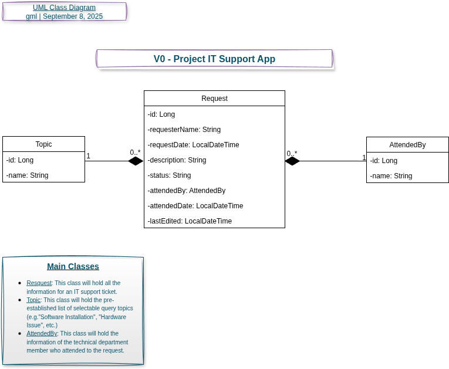
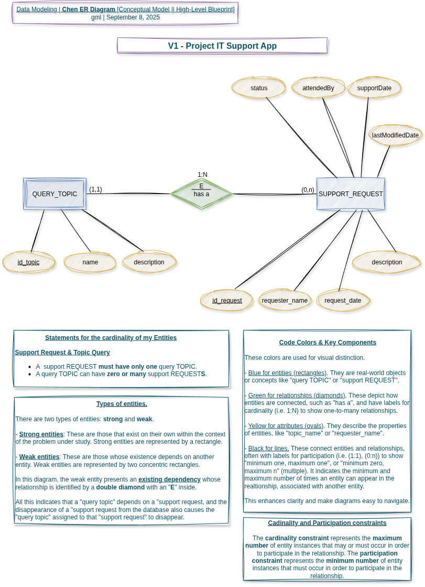
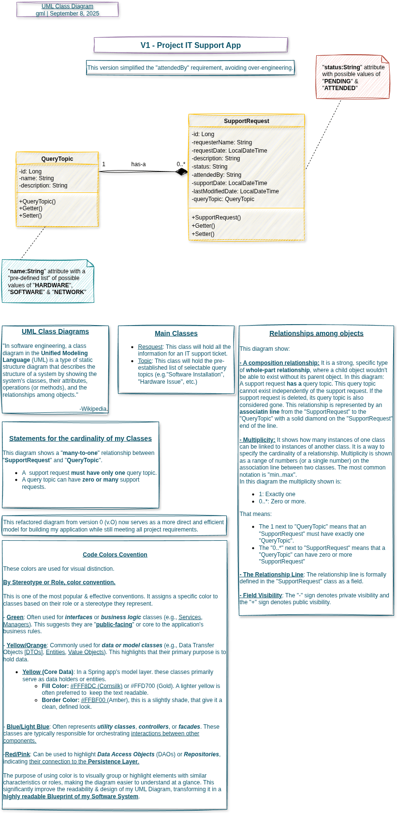
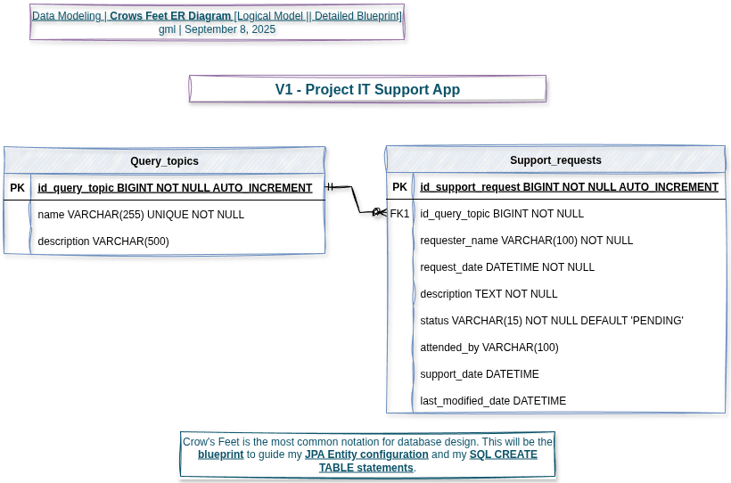

# 🚧 Support App - Helpdesk

This repository, currently under development, will contain the backed API for a support ticket system. Developed using **Java 21** and the **Spring Boot** framework, the API will provide essential functionality for submitting new requests, retrieving lists of queries, and managing their lifecycle, including updating and deleting records. **Spring Data JPA** will be used for data persistence with a **MySQL** or **H2** database.

## 🔍 Strategic approach

The development of the _IT Support Application [API](https://www.youtube.com/watch?v=-0MmWEYR2a8)_ followed a 
**structured**, **design-first methodology** to ensure a **clean**, **maintainable**, and **requirement-compliant codebase**. 
This approach  prioritized **planning & clarity before implementation**.

### Phase 1: Requirement Analysis & Design

The first step was a thorough analysis of the provided requirements to define the system's core entities and their
interactions. The key decision was to model the domain with two primary entities:

1. `SupportRequest`: The central entity capturing all details of an IT support ticket, including the requester's information,
description, status. and resolution details.
2. `QueryTopic`: A simple entity representing a pre-defined category for a support request (e.g., "Hardware", "Software",
"Network").

A critical design choice was implementing the `attendedBy` field as a simple `String` attribute within the `SupportRequest`
entity, as the requirements specified that "the name is sufficient". This avoided the unnecessary complexity of a separate
`AttendedBy` entity that had been developed during [the first iteration of data modeling](https://drive.google.com/file/d/16qDHQL90SybGKDVy8zojMT8z7ynZN-CD/view?usp=sharing),
which would likely caused over-engineering.

The relationships between these entities were mapped out using three standard diagramming techniques to ensure **conceptual**,
**logical**, and **physical** clarity:

#### [Chen ERD (Entity-Relationship Diagram)](https://drive.google.com/file/d/18vB-oB9NdWm-C_YKqap70lsHZ8YoMXLD/view?usp=sharing)

Modeled the _conceptual data structure_, confirming the **one-to-many** relationship (1:N) where one `QueryTopic` can
be associated with many `SupportRequests`.

This is the highest-level of a system. It focuses on the main concepts and relationships, in some cases without detailing
specific attributes or data types. It represents the  **"what"** of a system.

An analogy might be a "brainstorming whiteboard sketch" showing the main ideas.

Its target audience is business stakeholders & analyst who want to understand the basic structure and requirements of the
system.

#### [UML Class Diagram](https://drive.google.com/file/d/1ODXg0HTggSDxivPcBdUDmPM8onAAww1D/view?usp=sharing)

Defined the Object-Oriented structure of the application's _Model Layer_, specifying attributes, methods, and the crucial
**"has-a"** relationship between a `Supportrequest` and its `QueryTopic`

This model adds more detail to the conceptual model. It represents the **"how"** of a system from a design perspective,
independent of a specific programming language or database.

An analogy might be a detailed architectural **blueprint** (plan) of a building, showing the rooms, their functions, and how they connect,
but not specifying the amount of materials that will be needed.

The primary audience for a UML class diagram is the **development team** (i.e., Software Engineers, Developers, Architects,
Q/A Testers, Project Managers, and Technical Writers). It is a key artifact for anyone who needs a deep,
technical understanding of the application's core structure.

#### [Crow's Feet Notation Diagram](https://drive.google.com/file/d/173GMb_QLUh5cmJ02SGvG0cTyiuUlkDQD/view?usp=sharing)

The physical schema of the database was detailed, although it still presented an abstract view because it was independent
of the specific technology. Table names, column data types, constraints (`NOT NULL`, `UNIQUE`), and the _foreign key_ relationship
that guarantees _data integrity_ at the database level were specified.

An analogy might be a construction plan detailing the exact type of wood, steel, and concrete to be used for each part of
the building.

Its target audience is database designers, who use it to model data and its relationships at the physical level for a 
specific [database management system (DBMS)](https://en.wikipedia.org/wiki/Database#Database_management_system)

### Phase 2: Project Setup & Agile Planning

Following the design phase, the project was initialized using [Spring Boot](https://spring.io/projects/spring-boot). 
The [Jira](https://en.wikipedia.org/wiki/Jira_(software)) backlog was structured into epics, user stories, and tasks 
based on the requirements, ensuring traceability and providing a clear roadmap for the two-week sprint. 
Development follows a Git Feature Branch wit Jira workflow (`key-N-[features || technical & documentary deliverables]`,
e.g. `PITSA-5-IT-view-requests`) to isolate changes and facilitate code reviews before merging into the main development branch.

### Phase 3: Incremental Implementation

The implementation strategy is to build the application incrementally, following the priority of the user stories:

1. **Foundation**: Implement the core entities (`QueryTopic`, `SupportRequest`) and database repositories.

2. **Employee API Functionality**: Develop endpoints for employees to list query topics and submit new requests.

3. **Technical Department API Functionality**: Develop endpoints for the technical department to list, update, and manage
support requests.

4. **Validation & Testing**: Concurrently write [unit](https://en.wikipedia.org/wiki/Unit_testing) and [integration tests](https://en.wikipedia.org/wiki/Integration_testing)
for each layer (Models, Services, Controllers) to meet the 70%+ [test coverage](https://en.wikipedia.org/wiki/Software_testing) requirement.

5. **Project Documentation & Deliverables**: Integrate [Swagger/OpenAPI](https://swagger.io/) for interactive API docs and compile a complete 
[Postman](https://www.postman.com/) collection for testing and demonstration.

This methodical, diagram-driven approach ensures the [API](https://www.youtube.com/watch?v=-0MmWEYR2a8) is built on a solid architectural foundation,
minimizing refactoring and aligning closely with all specified functional requirements.